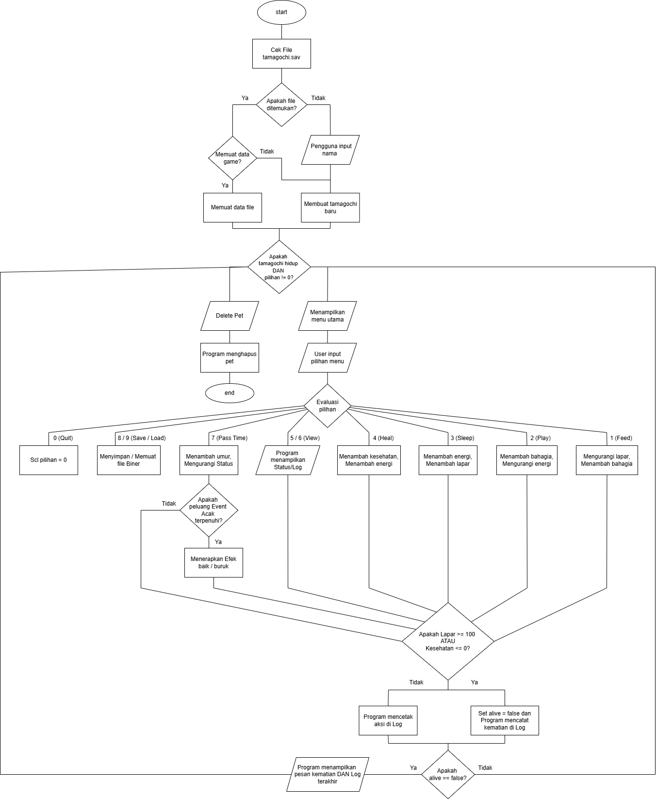

# Tamagotchi

tamagochi app or something

[Pseudocode](https://github.com/farizqyy/tamagotchi/blob/main/Pseudocode.txt)

[Flowchart:](https://github.com/farizqyy/tamagotchi/blob/main/Flowchart_Tamagotchi.png)

<div align="center">
  <kbd>
    
  </kbd>
</div>

## Description

description of tamagotchi or something

### Features

pet

### Built with

- my pc
- sum ai

## Getting started

### Prerequisites

MinGW, any terminal

### Install

grab the 
[tamagochi](https://github.com/farizqyy/tamagotchi/blob/main/tamagotchi.cpp)
file

cd into the file

run

```sh
g++ tamagotchi.cpp -o tamagotchi
```

note that some terminal might not be supported

### Purpose

Tamagotchi is a usefull aplication to add boredoom

### Troubleshooting

do it yourself

### To-do

- [x] ~~Make the program~~
- [x] ~~Make the flowchart~~
- [x] ~~Make pseudocode~~
- [ ] Make a report
- [ ] implement sum more stuff
